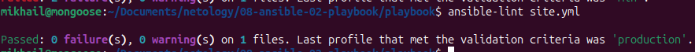
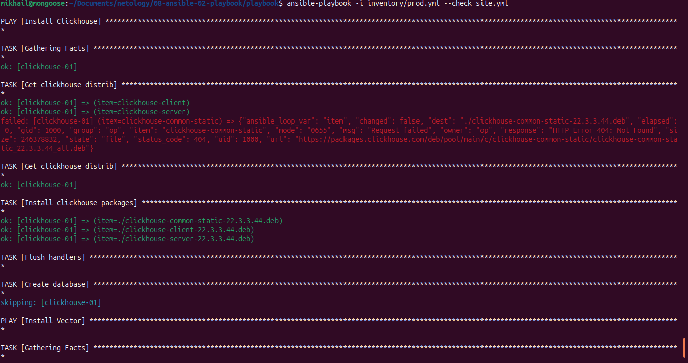
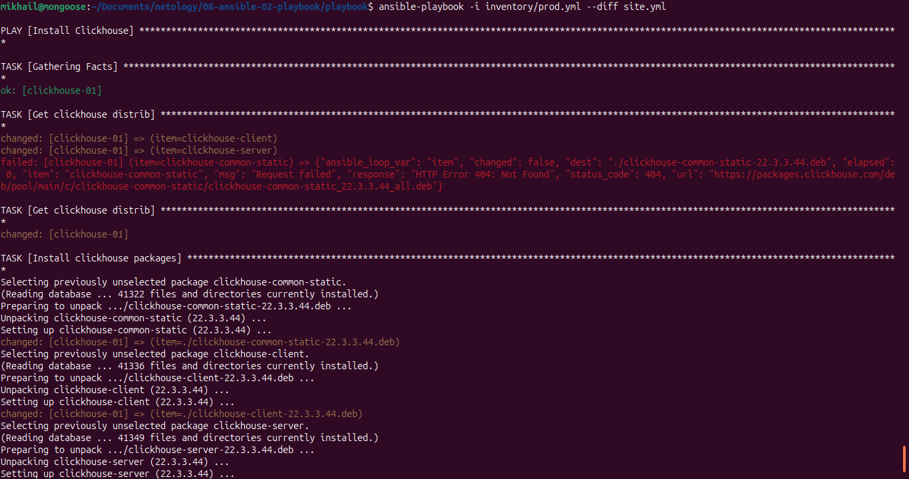
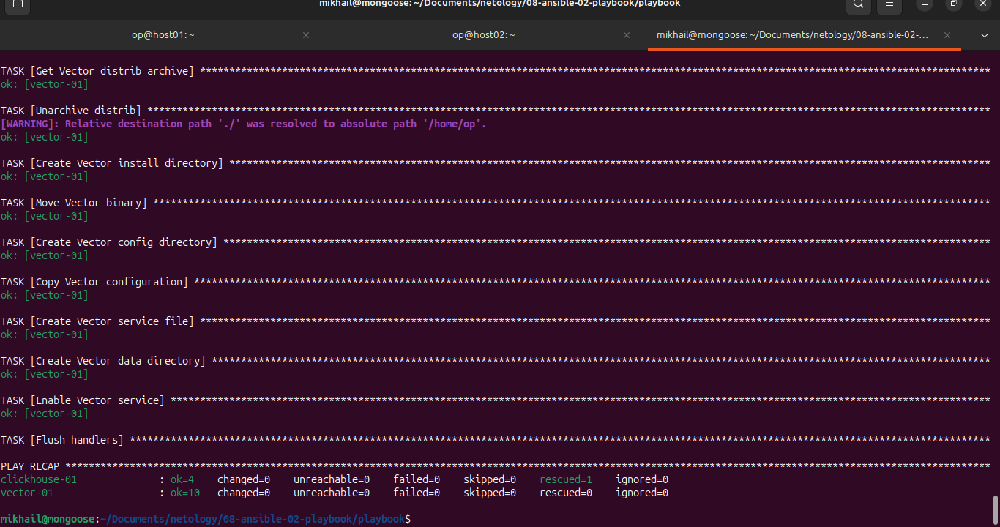

# Скриншоты к заданию

## Пункт 5 
- Делаем ansible-lint

## Пункт 6
- Запускаем с ключем --check 

## Пункт 7
- Запускаем плейбук с ключем --diff

## Пункт 8
- Повторно запускаем с ключом --diff. Убеждаемся в идемпотентности.
